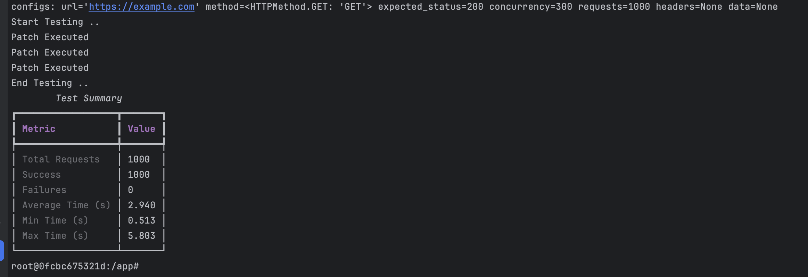

# 🔥 Load Tester


A lightweight, extensible, and developer-friendly **load testing tool** built with Python.  
This tool helps developers benchmark the performance and reliability of their APIs or services with ease.


## 🚀 Features

- Easy to use CLI interface
- Configuration through command-line flags
- Rich terminal output with live progress, stats, and summaries
- Supports concurrent request execution
- Extensible and modular codebase
- Validated input using Pydantic models
- Fully tested with Pytest

## 📦 Installation


1. clone
```
git clone https://github.com/Mark-Amgad/load-tester
```
2. go to the project
```
cd load-tester
```
3. docker-compose
```
docker-compose up -d
```
4. open bash
```
docker-compose exec load-tester bash
```

To Run test Cases:

```
poetry run pytest
```

## Usage Example

```
poetry run load-tester --url https://example.com --requests 50 --concurrency 30
```

### Possible flags:

```
poetry run load-tester --help
```

1. url
2. method [optional, default: GET]
3. requests [optional, default: 100]
4. concurrency [optional, default: 10]
5. expected_status [optional, default: 200]


### Output Example 


